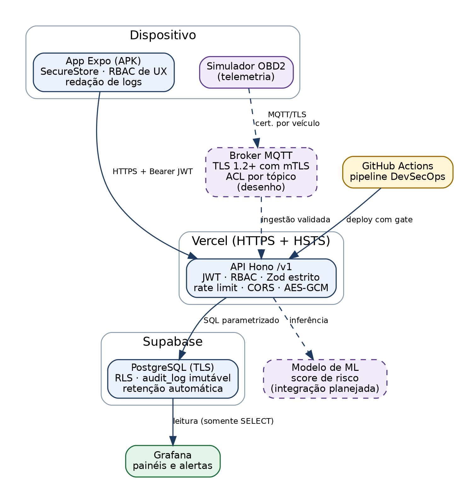
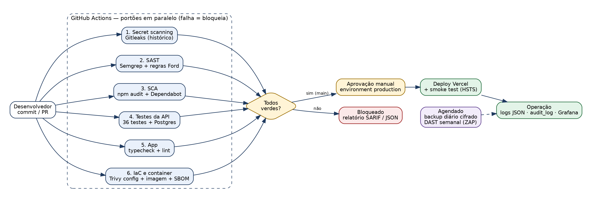

# Apresentação

Este documento consolida a Sprint 3 de Cybersecurity do projeto Ford Intelligence no modelo DevSecOps. Ele está dividido nas quatro subetapas da rubrica e integra API, app mobile, IoT, dados, ML e arquitetura em uma única solução.

| Subetapa da rubrica | Peso | Seção |
|---|---|---|
| Pipeline DevSecOps Integrado | 3,0 | 1 |
| Segurança em Código e Infraestrutura | 2,5 | 2 |
| Observabilidade, Monitoramento e Resposta | 2,0 | 3 |
| Compliance, Riscos e Segurança Contínua | 2,5 | 4 |

**Repositório:** github.com/vmismael/Cyber-Sprint-Ford. Todo trecho de código citado aqui existe no repositório, e cada melhoria aponta o commit em que entrou.

**Legenda de status usada nas tabelas:** *Implementado* = em código, testado · *Implementado (app)* = no app mobile · *Desenho* = arquitetura documentada, sem implementação nesta fase · *Planejado* = próximo passo com dono e prazo.

## Arquitetura considerada

Até a sprint anterior, o Ford Intelligence era um app Expo que consumia APIs simuladas dentro do próprio aparelho. Nesta sprint ganhou uma API real na Vercel, e as decisões de segurança passaram do cliente para o servidor.



| Componente | Tecnologia | Papel na segurança |
|---|---|---|
| App mobile | React Native + Expo (APK via EAS Build) | Armazenamento seguro, RBAC de interface, redação de logs |
| API | Hono em TypeScript na Vercel | Autenticação, autorização, validação, auditoria |
| Banco de dados | PostgreSQL (Supabase) | RLS, trilha imutável, retenção automática |
| Telemetria (IoT) | Simulador OBD2 no app + broker MQTT (desenho) | TLS mútuo e ACL por veículo |
| Modelo de ML | Scikit-learn (disciplina de IA) | Score de risco, integração planejada via API |
| CI/CD | GitHub Actions | Seis portões de segurança antes do deploy |

**Perfis de acesso.** A rubrica cita "Brigadista, Gestor, Administrador". No Ford Intelligence os três perfis equivalentes são:

| Perfil | Quem é | O que pode fazer |
|---|---|---|
| client (Cliente) | Proprietário do veículo | Próprio perfil, próprios agendamentos, carteira |
| analyst (Analista) | Analista de pós-venda | Dashboard e leads com dados mascarados |
| admin (Administrador) | Equipe Ford da plataforma | Tudo do analista + gestão de usuários, perfis e trilha de auditoria |

<<<PAGEBREAK>>>

# 1. Pipeline DevSecOps Integrado

## 1.1 Desenho do pipeline

O pipeline está em `.github/workflows/devsecops.yml` e roda a cada push e pull request. São seis portões independentes executados em paralelo. Se qualquer um falhar, o merge fica bloqueado. O deploy para produção só acontece na branch main, depois que todos passaram e alguém aprovou manualmente no environment `production` do GitHub.



O deploy automático da Vercel pelo Git foi desligado de propósito (`backend/vercel.json`). Assim o pipeline é o único caminho até a produção, e nenhum código chega lá sem passar pelos portões.

## 1.2 Etapas e riscos que cada uma reduz

| # | Etapa | Ferramenta | Quando bloqueia | Risco reduzido |
|---|---|---|---|---|
| 1 | Secret scanning | Gitleaks 8.30.1 + regra própria | Qualquer segredo no histórico | Vazamento de chaves (R10), OWASP M1 |
| 2 | SAST | Semgrep 1.178.0 (6 pacotes + 7 regras próprias) | Achado de severidade ERROR | Injeção, JWT mal validado, dado sensível sem cifra |
| 3 | SCA | npm audit + Dependabot | API: High; app: Critical | Dependência vulnerável (R9), OWASP M2 |
| 4 | Testes da API | Vitest + PostgreSQL 16 | Qualquer teste falhando | Regressão de autenticação, RBAC e IDOR |
| 5 | Qualidade do app | tsc + ESLint | Erro de tipo ou lint | Erros que viram falha de validação |
| 6 | IaC e container | Trivy 0.74.0 | Misconfiguração média+; CVE High/Critical com correção | Imagem vulnerável, root, segredo em camada (R16) |

**Por que cada etapa existe:**

- **Gitleaks** varre o histórico inteiro (`fetch-depth: 0`), porque um segredo apagado num commit posterior continua exposto nos anteriores. As regras padrão do Gitleaks não detectaram o segredo fixo que existia no app (`MOCK_SECRET`), já que ele tinha pouca entropia. Por isso criamos a regra `ts-hardcoded-secret-constant` no `.gitleaks.toml`, e ela encontrou o problema (seção 2.1).
- **Semgrep** combina pacotes da comunidade (`p/default`, `p/typescript`, `p/react`, `p/nodejsscan`, `p/jwt`, `p/secrets`) com regras escritas para os riscos específicos do projeto em `.semgrep/ford-rules.yml`.
- **npm audit** usa limites diferentes para a API e para o app. A API não tolera nada High. No app, as vulnerabilidades High restantes estão em ferramentas de build do Expo, que não vão para o APK (triagem na seção 4.1). O Dependabot abre PRs semanais que passam pelo mesmo pipeline.
- **Testes com banco real:** o job sobe um PostgreSQL 16 como serviço e roda os 43 testes, a migração duas vezes (para provar que é idempotente) e uma tentativa de `UPDATE` na trilha de auditoria, que precisa falhar.
- **Trivy** verifica o Dockerfile antes do build e a imagem depois. Também gera um SBOM (CycloneDX), que fica 90 dias como artefato para rastrear componentes se surgir um CVE novo.

## 1.3 Segurança do próprio pipeline

Um pipeline que protege o código também precisa ser protegido, porque ele tem acesso aos segredos de deploy.

| Controle | Implementação |
|---|---|
| Actions fixadas por SHA | `actions/checkout@3d3c42e…` em vez de `@v7`. Uma tag pode ser movida para código malicioso; o SHA não |
| Binários verificados | Gitleaks e Trivy baixados com versão fixa e `sha256sum --check` antes de executar |
| Permissão mínima | `permissions: contents: read` no workflow inteiro |
| Sem `pull_request_target` | PR vindo de fork roda sem acesso a secrets |
| Secrets no cofre | `VERCEL_TOKEN`, `BACKUP_PASSPHRASE` etc. em *Settings > Secrets*, nunca no YAML |
| Aprovação humana | Environment `production` com revisor obrigatório |
| Smoke test pós-deploy | Confere `/v1/health` e a presença do cabeçalho HSTS em produção |

```yaml
- name: Instalar Gitleaks (checksum verificado)
  run: |
    curl -sSfL -o gitleaks.tgz \
      "https://github.com/gitleaks/gitleaks/releases/download/v${GITLEAKS_VERSION}/gitleaks_${GITLEAKS_VERSION}_linux_x64.tar.gz"
    echo "${GITLEAKS_SHA256}  gitleaks.tgz" | sha256sum --check --strict
    tar -xzf gitleaks.tgz gitleaks
```

## 1.4 Como o pipeline roda no projeto Ford

1. O desenvolvedor abre um PR para a main. Os seis jobs começam ao mesmo tempo, e o resultado aparece no próprio PR.
2. Se o Gitleaks encontra um segredo, o PR é bloqueado e o relatório SARIF fica disponível como artefato. O segredo precisa ser rotacionado (playbook na seção 3.4); apagar o commit não basta.
3. Com os seis verdes e o PR aprovado, o merge dispara o job de deploy. Ele espera a aprovação no environment `production`, publica na Vercel e roda o smoke test.
4. Fora do fluxo de PR, o workflow `scheduled-security.yml` faz backup cifrado diário do banco e uma varredura DAST semanal com OWASP ZAP contra a API publicada.

## 1.5 Validação local das ferramentas

Antes de subir o pipeline, rodamos cada ferramenta no repositório para confirmar que ela funciona e calibrar os limites.

| Ferramenta | Resultado | Leitura |
|---|---|---|
| Gitleaks (histórico, 9 commits originais) | 1 achado com regras padrão; 5 com a regra própria | A regra própria encontrou o segredo fixo que as padrão não viram |
| Gitleaks (após correções e triagem) | 0 achados | Falsos positivos justificados em `.gitleaksignore` |
| Semgrep (regras Ford) no commit ec8c82b | 1 achado: `ford-asyncstorage-dado-sensivel` | Teria pego a carteira em AsyncStorage antes da correção manual |
| Semgrep (regras Ford) no código atual | 0 achados | |
| Trivy no Dockerfile da API | 0 misconfigurações | |
| Trivy num Dockerfile inseguro (contraprova) | 4 falhas: 1 crítica, 1 alta, 1 média, 1 baixa | Detectou segredo em ENV, execução como root, imagem sem tag e ausência de HEALTHCHECK |
| npm audit (app) | 34 → 22 vulnerabilidades; críticas 2 → 0 | Corrigidas as que não exigiam upgrade major |
| npm audit (API) | 0 vulnerabilidades | |

**Primeira execução no GitHub (PR #1).** Cinco portões passaram de primeira. O Semgrep bloqueou o PR com um achado de severidade ERROR vindo dos pacotes da comunidade, que não tínhamos rodado localmente: `gcm-no-tag-length` em `backend/src/lib/crypto.ts`. A decifra AES-256-GCM não fixava o tamanho da tag de autenticação, e o Node aceita tags de até 4 bytes; uma tag curta pode ser forjada por força bruta. Era um defeito real, não falso positivo: um teste escrito para o caso mostrou que o código anterior aceitava a tag truncada para 4 bytes. A correção entrou no commit 713d96a (seção 2.2), e o portão passou sem nenhuma supressão.

> [PRINT] Aba Actions do GitHub com o workflow devsecops concluído e os seis jobs verdes.
> [PRINT] Um PR bloqueado pelo Gitleaks (faça um commit de teste com um segredo falso numa branch descartável).
> [PRINT] Artefatos do workflow: gitleaks-report, semgrep-report, sca-report e sbom.
> [PRINT] Página do environment production com a aprovação pendente antes do deploy.

<<<PAGEBREAK>>>

# 2. Segurança em Código e Infraestrutura

Esta seção mostra as correções reais aplicadas. Cada item traz o problema encontrado, o trecho corrigido e o commit.

| Commit | O que mudou |
|---|---|
| 6a0ab37 | `.gitignore` (o repositório não tinha nenhum) e configuração do Gitleaks |
| 1007914 | Remoção do segredo embarcado e da pseudo-assinatura do app |
| c784097 | Schemas da carteira alinhados aos tipos reais |
| 6b55299 | Atualização de dependências (críticas 2 → 0) |
| 02d4218 | API com JWT, RBAC, auditoria, cifra de campo e hardening |
| 187a670 | App passa a autenticar na API real |
| cb30703 | Pipeline DevSecOps, Dependabot e rotinas agendadas |
| 713d96a | Tag GCM fixada em 16 bytes na cifra de campo (achado do Semgrep no pipeline) |
| 0cc5d2a | RLS na tabela de controle de migrações (achado na conferência do banco de produção) |

## 2.1 Correções no app mobile

### Segredo embarcado no bundle (OWASP M1)

**Problema:** o app tinha `MOCK_SECRET = 'ford-intelligence-mock-secret-v1'` em três arquivos e usava esse valor para "assinar" tokens e payloads. Todo texto dentro do bundle pode ser extraído de um APK com ferramentas públicas, então a assinatura não protegia nada. Além disso, a construção `SHA-256(segredo + payload)` não é um HMAC de verdade e é suscetível a ataque de extensão de comprimento.

**Correção:** o segredo e o arquivo `src/utils/hmac.ts` foram removidos. Integridade e autenticidade agora vêm da API: TLS no transporte, JWT assinado no servidor e validação de cada payload com schema.

```typescript
// src/services/mocks/schedulingApi.ts — depois (commit 1007914)
// Sem segredo embarcado (OWASP M1): integridade e autorização ficam na API real.
export async function createBooking(draft: CreateBookingPayload): Promise<Booking> {
  checkRateLimit('createBooking', 3, 60_000);
```

### Cliente escolhia o próprio perfil de acesso

**Problema:** no login simulado, o formulário enviava `isAnalyst: true` e o app criava a sessão como analista. Qualquer cliente podia se tornar analista e ver leads.

**Correção:** no modo API real, o campo é ignorado e o perfil vem do banco. A API também não aceita `role` no cadastro (seção 2.2).

```typescript
// src/services/api/authService.ts (commit 187a670)
// No modo real, o perfil de acesso (client/analyst/admin) é decidido pelo servidor.
export async function login(payload: LoginPayload): Promise<AuthSession> {
  if (!isLiveApi) return { ...(await mock.login(payload)), refreshToken: null };
  const pair = await apiRequest<TokenPair>('/v1/auth/login', {
    method: 'POST',
    body: { email: payload.email, password: payload.password }, // isAnalyst não é enviado
  });
  return toSession(pair);
}
```

### Cliente HTTP com TLS obrigatório e renovação segura de sessão

O novo `src/services/api/httpClient.ts` recusa URL `http://` em build de produção, passa todo destino pela allowlist de domínios, aplica timeout de 12 segundos e guarda access e refresh token no SecureStore (Keystore no Android). Em resposta 401, tenta renovar a sessão uma única vez, e várias requisições simultâneas compartilham o mesmo refresh.

```typescript
if (isLiveApi && !__DEV__ && !API_URL.startsWith('https://')) {
  throw new Error('EXPO_PUBLIC_API_URL precisa usar https:// em builds de produção.');
}
```

### Outras correções no app

| Problema | Correção | Commit |
|---|---|---|
| Repositório sem `.gitignore`: um `.env` com a chave do Google Maps poderia ser commitado | `.gitignore` bloqueia `.env*`, keystores e builds | 6a0ab37 |
| Schema de cupons diferente do tipo: ao reler a carteira do SecureStore, campos eram descartados e `category`/`plan` aceitavam qualquer texto | Schemas Zod espelham exatamente os tipos | c784097 |
| Logger do app não redigia `refreshToken` nem `authorization` | Chaves adicionadas à lista de redação | 187a670 |
| Logout só apagava o token local | Logout também revoga a sessão no servidor | 187a670 |

Controles já existentes no app e mantidos: tokens, perfil e carteira no SecureStore (e990165), validação e sanitização de formulários (bd79dab), RBAC de interface (3ceebe9, edf2d30), retenção de 90 dias para agendamentos (996fe95) e trilha de auditoria local (ec8c82b, 7d567e3).

## 2.2 Hardening da API

### JWT seguro

O token é assinado com HS256 e o algoritmo é fixado na validação, o que bloqueia o ataque `alg: none` e a troca de algoritmo. Issuer e audience também são conferidos, e o token vale 15 minutos. O segredo tem no mínimo 32 caracteres, validados na inicialização: sem ele, a API não sobe.

```typescript
// backend/src/lib/jwt.ts
const { payload } = await jwtVerify(token, key, {
  algorithms: ['HS256'], // algoritmo fixo: bloqueia `alg: none` e troca de algoritmo
  issuer: 'ford-intelligence-api',
  audience: 'ford-intelligence-app',
  requiredClaims: ['sub', 'exp', 'iat', 'jti'],
});
```

O refresh token é um valor aleatório de 32 bytes. O banco guarda só o hash SHA-256. A cada uso ele é trocado por um novo, e se um token já usado reaparecer (sinal de roubo) toda a família de sessões é revogada.

### Controle de acesso por perfil

A matriz de permissões nega por padrão. O perfil usado na decisão é lido do banco a cada requisição, não do token: quando um admin rebaixa um analista, o acesso cai na hora, mesmo com o token antigo ainda válido.

```typescript
// backend/src/security/rbac.ts
export const PERMISSIONS = {
  client:  ['profile:read:own', 'profile:write:own', 'booking:read:own', 'booking:write:own'],
  analyst: ['profile:read:own', 'profile:write:own', 'lead:read', 'dashboard:read'],
  admin:   ['profile:read:own', 'profile:write:own', 'lead:read', 'dashboard:read',
            'booking:read:any', 'user:read', 'user:role:write', 'audit:read'],
} as const;
```

Além do perfil, cada agendamento tem a posse conferida. Um cliente que tenta abrir o agendamento de outro recebe 404, e não 403, para não confirmar que aquele ID existe (proteção contra BOLA/IDOR, OWASP API1).

### Validação de entrada

Todo schema de entrada é estrito: um campo desconhecido gera 422. Isso impede mass assignment, como mandar `"role": "admin"` no cadastro. A resposta de erro lista o campo e o motivo, mas nunca devolve o valor recebido, para não refletir conteúdo malicioso.

| Controle | Detalhe |
|---|---|
| Senha | 8 a 72 caracteres (limite do bcrypt), com letra e número; hash bcrypt custo 12 |
| Texto livre | Bloqueia `<`, `>` e caracteres de controle |
| Identificadores | UUID validado antes de chegar ao banco |
| Paginação | Limite máximo de 100 itens |
| Corpo | Máximo de 32 KB (413 acima disso) |
| SQL | Consultas parametrizadas por tagged template; `sql.unsafe` barrado por regra Semgrep |

### Rate limit e bloqueio de conta

| Camada | Limite | Resposta |
|---|---|---|
| Login, cadastro e refresh por IP | 10 por minuto | 429 com `Retry-After` |
| Escrita e leitura sensível por usuário | 60 por minuto | 429 com `Retry-After` |
| Conta, após 5 senhas erradas | Bloqueio de 15 minutos, gravado no banco | 429 com `Retry-After` |

O bloqueio de conta fica no banco porque precisa valer entre as instâncias da Vercel. O rate limit por IP fica em memória por instância, e esse limite está documentado. A evolução prevista é trocar o armazenamento por Redis (Upstash) sem mudar a interface. Senha errada e e-mail inexistente recebem a mesma mensagem e o mesmo tempo de resposta, porque o bcrypt roda contra um hash fixo quando o e-mail não existe. Assim ninguém descobre quais e-mails têm conta.

### Cabeçalhos, CORS e erros

A API envia HSTS de 2 anos, `X-Frame-Options: DENY`, `X-Content-Type-Options: nosniff`, `Referrer-Policy: no-referrer` e uma CSP `default-src 'none'`, já que só devolve JSON. A página `/docs` (Swagger UI) é a única exceção: recebe uma CSP própria que libera apenas o CSS e o JS do jsDelivr, escolhida no mesmo middleware para que a CSP da API não a sobrescreva. O CORS responde apenas às origens da allowlist; o app nativo não envia `Origin`. Todo erro segue o formato `application/problem+json` (RFC 9457) com um `requestId` que liga a resposta ao log. Erros inesperados devolvem mensagem genérica, e o detalhe fica só no log do servidor.

### Criptografia de dados

| Dado | Em trânsito | Em repouso |
|---|---|---|
| Endereço de coleta e observações do agendamento | TLS 1.2+ (Vercel) | AES-256-GCM na aplicação, chave fora do banco |
| Senha | TLS | Hash bcrypt |
| Refresh token | TLS | Hash SHA-256 |
| Token e dados no aparelho | — | SecureStore (Android Keystore) |
| Banco | TLS obrigatório na conexão | Disco cifrado pelo Supabase |
| Backup | — | AES-256 com PBKDF2 (200 mil iterações) |

```typescript
// backend/src/lib/crypto.ts — GCM cifra e detecta adulteração
const iv = randomBytes(IV_LENGTH); // 12 bytes
const cipher = createCipheriv('aes-256-gcm', key, iv, { authTagLength: TAG_LENGTH }); // 16 bytes
const data = Buffer.concat([cipher.update(plain, 'utf8'), cipher.final()]);
const tag = cipher.getAuthTag();

// na decifra, tag com tamanho diferente de 16 bytes é recusada antes de verificar
if (ivBuf.length !== IV_LENGTH || tagBuf.length !== TAG_LENGTH) throw new Error('Payload cifrado inválido');
const decipher = createDecipheriv('aes-256-gcm', key, ivBuf, { authTagLength: TAG_LENGTH });
```

O tamanho fixo da tag veio de um achado do Semgrep na primeira execução do pipeline (commit 713d96a). Sem ele, a decifra aceitava uma tag truncada para 4 bytes, e 32 bits de autenticação podem ser forjados por força bruta.

### Testes automatizados de segurança

São 43 testes em `backend/tests`, executados pelo pipeline a cada PR. Para provar que os testes realmente testam, removemos de propósito a checagem de posse do agendamento: o teste de IDOR falhou, e voltou a passar quando a proteção foi restaurada.

| Cenário | Esperado |
|---|---|
| Rota protegida sem token; token adulterado; `alg: none`; token expirado | 401 |
| Cliente acessa leads; analista altera perfil de acesso | 403 |
| Cliente B lê ou cancela agendamento do cliente A | 404 |
| `"role": "admin"` no cadastro; HTML nas observações; senha fraca | 422 |
| 5 senhas erradas (de IPs diferentes); 11 logins do mesmo IP | 429 |
| Refresh token reutilizado | 401 e revogação da família |
| Endereço gravado | Cifrado no armazenamento, decifrado só para o dono |
| Tag GCM truncada (4, 8 e 12 bytes), cifra adulterada ou chave errada | Decifra recusada |
| Página `/docs` | CSP própria libera só o jsDelivr; o resto da API mantém `default-src 'none'` |
| Logs | Sem senha, token ou IP em claro; toda linha com timestamp ISO, que nenhum campo do chamador sobrescreve |

> [PRINT] Terminal com `npm test` mostrando os 43 testes aprovados.
> [PRINT] Swagger em /docs com o cadeado Bearer e a lista de rotas.
> [PRINT] Requisição com token de cliente em GET /v1/leads retornando 403 (Postman, Insomnia ou curl).
> [PRINT] Resposta 429 com cabeçalho Retry-After após as 5 tentativas erradas.

## 2.3 Banco de dados

A migração `backend/db/migrations/001_init.sql` aplica restrições (`check`) em todos os campos com domínio fechado e liga Row Level Security em todas as tabelas. Sem políticas, o RLS bloqueia as chaves públicas do Supabase (anon/authenticated), que de outra forma dariam acesso à REST automática do banco. A API conecta com credencial de servidor.

A trilha de auditoria é somente-inclusão. Um trigger impede qualquer edição e só permite apagar registros com mais de 6 meses, o prazo de guarda do Marco Civil da Internet.

```sql
create or replace function audit_log_guard() returns trigger language plpgsql as $$
begin
  if tg_op = 'UPDATE' then
    raise exception 'audit_log é imutável';
  end if;
  if tg_op = 'DELETE' and old.timestamp > now() - interval '6 months' then
    raise exception 'audit_log: registro dentro do prazo de retenção';
  end if;
  return old;
end $$;
```

Testado em PostgreSQL 16: `update audit_log set event='x'` retorna `ERROR: audit_log é imutável`. O pipeline repete esse teste a cada execução.

**Conferência no banco de produção (Supabase, PostgreSQL 17.6).** Depois da migração, conferimos direto no banco: as 7 tabelas de `public` com RLS ligado e nenhuma política; senhas do seed em bcrypt; `UPDATE` e `DELETE` em `audit_log` recusados pelo trigger, testados dentro de uma transação desfeita para não deixar evento falso na trilha. A conferência encontrou uma falha: a tabela `schema_migrations`, criada pelo script de migração, estava sem RLS. No Supabase, as chaves públicas têm permissão padrão em todo o schema `public`, e alguém com a chave `anon` poderia inserir um nome de arquivo e fazer uma migração futura ser pulada. Corrigido no commit 0cc5d2a.

## 2.4 Infraestrutura como código

O `backend/Dockerfile` permite rodar a API fora da Vercel, por exemplo em homologação ou num ambiente da própria Ford.

| Boa prática | Como foi aplicada |
|---|---|
| Multi-stage | Build separado; a imagem final só tem `dist/` e dependências de produção |
| Usuário não-root | `USER node` |
| Base mínima e atualizada | `node:22-alpine3.22` + `apk upgrade` |
| Menos superfície | npm, npx, corepack e yarn removidos da imagem final |
| Sem segredos em camadas | Tudo via variável de ambiente; `.dockerignore` exclui `.env*` |
| Saúde | `HEALTHCHECK` em `/v1/health` |

O `backend/.env.example` documenta todas as variáveis sem valores reais, e o `backend/src/config/env.ts` valida cada uma na inicialização: segredo curto ou ausente impede a API de subir.

## 2.5 Segurança MQTT/TLS para IoT (desenho)

A telemetria real viria da porta OBD2 do veículo por um broker MQTT. Nesta fase ela é simulada no app (`src/features/telemetry/simulator.ts`), e o broker está documentado como desenho.

| Controle | Configuração proposta |
|---|---|
| Transporte | MQTT sobre TLS 1.2+ na porta 8883; porta 1883 (texto claro) fechada |
| Autenticação | TLS mútuo: cada veículo tem certificado próprio emitido por uma CA da Ford |
| Autorização | ACL por tópico: o veículo só publica em `vehicles/<VIN>/telemetry` |
| Revogação | Certificado revogado na CA ao detectar dispositivo comprometido (playbook 3.4) |
| Validação na ingestão | Schema e faixas físicas plausíveis (ex.: pressão de pneu entre 10 e 60 psi) antes de chegar ao modelo de ML |

```conf
# mosquitto.conf (proposta)
listener 8883
cafile   /etc/mosquitto/ca/ford-devices-ca.crt
certfile /etc/mosquitto/certs/broker.crt
keyfile  /etc/mosquitto/certs/broker.key
tls_version tlsv1.2
require_certificate true
use_identity_as_username true
allow_anonymous false
acl_file /etc/mosquitto/acl

# acl — o CN do certificado é o VIN do veículo
pattern write vehicles/%u/telemetry
pattern read  vehicles/%u/commands
```

<<<PAGEBREAK>>>

# 3. Observabilidade, Monitoramento e Resposta

## 3.1 Logs estruturados

A API emite uma linha JSON por evento, com campos fixos. Isso permite filtrar, agregar e alertar sem depender de texto livre. Todos os logs vão para o stdout, que a Vercel coleta, e os eventos de segurança também são gravados na tabela `audit_log`. Exemplo no formato emitido pela API:

```json
{
  "timestamp": "2026-09-23T23:32:46.095Z",
  "level": "warn",
  "service": "ford-api",
  "env": "development",
  "event": "auth.login_failed",
  "requestId": "0f4f8cfa-e52d-4c7f-8720-06ff54787317",
  "userId": null,
  "role": null,
  "ipHash": "hmac:03dbe551ee1ccd93",
  "route": "POST /v1/auth/login",
  "status": 401,
  "meta": { "reason": "unknown_email" }
}
```

**Regras de redação (LGPD):** senha, tokens, cabeçalho `Authorization`, endereço, telefone e coordenadas nunca aparecem, em nenhum nível de aninhamento. Nome e e-mail aparecem mascarados. O IP é gravado como HMAC com sal secreto: dá para correlacionar ataques do mesmo IP sem guardar o dado bruto. Há um teste automatizado que falha se uma senha, um token ou o IP aparecerem em qualquer linha de log.

**Eventos registrados:**

| Categoria | Eventos | Nível |
|---|---|---|
| Autenticação | `auth.register`, `auth.login_success`, `auth.logout`, `auth.token_refreshed` | info |
| Autenticação | `auth.login_failed`, `auth.lockout_activated`, `auth.token_expired`, `auth.token_invalid`, `auth.refresh_reuse_detected` | warn |
| Autorização | `authz.permission_denied`, `booking.access_denied` | warn |
| Abuso | `ratelimit.blocked` | warn |
| Alteração crítica | `user.role_changed` (com perfil anterior e novo), `profile.updated`, `booking.created`, `booking.cancelled` | info |
| Acesso a dado pessoal | `lead.accessed` | info |
| Sistema | `http.request` (toda requisição, com latência), `system.unhandled_error` | info/error |

## 3.2 Métricas e alertas

| Camada | Métrica | Limiar de alerta | Severidade |
|---|---|---|---|
| API | Respostas 5xx | > 2% em 5 min | Alta |
| API | `auth.login_failed` por `ipHash` | > 20 em 5 min | Média (força bruta) |
| API | `auth.lockout_activated` em contas distintas | > 5 em 15 min | Alta (credential stuffing) |
| API | `authz.permission_denied` por usuário | > 10 em 10 min | Média (escalonamento) |
| API | `auth.refresh_reuse_detected` | Qualquer ocorrência | Alta (sessão roubada) |
| API | `user.role_changed` | Fora do horário comercial | Alta |
| API | Latência p95 (`http.request`) | > 1,5 s por 10 min | Baixa |
| Mobile | Sessões sem crash | < 99% no dia | Média |
| IoT | Mensagens rejeitadas por dispositivo | > 50 em 5 min | Alta (dispositivo comprometido) |
| ML | Erros de inferência | > 5% em 15 min | Média |
| ML | Média semanal do score de risco (drift) | Desvio > 2 desvios-padrão | Baixa |

## 3.3 Dashboards

Ferramenta: **Grafana Cloud** (plano gratuito) com o PostgreSQL do Supabase como fonte de dados. O Grafana conecta com um usuário que só tem `SELECT` na trilha de auditoria:

```sql
create role grafana_reader login password '<senha forte gerada no cofre>';
grant usage on schema public to grafana_reader;
grant select on audit_log to grafana_reader;
```

Consultas dos painéis:

```sql
-- Painel 1: logins por hora (sucesso x falha)
select date_trunc('hour', timestamp) as time,
       count(*) filter (where event = 'auth.login_success') as sucesso,
       count(*) filter (where event = 'auth.login_failed')  as falha
from audit_log where $__timeFilter(timestamp) group by 1 order by 1;

-- Painel 2: negações de acesso e bloqueios de rate limit
select date_trunc('hour', timestamp) as time, event, count(*)
from audit_log
where event in ('authz.permission_denied', 'booking.access_denied', 'ratelimit.blocked')
  and $__timeFilter(timestamp)
group by 1, 2 order by 1;

-- Painel 3: acessos a dado pessoal por analista
select user_id, count(*) as acessos
from audit_log where event = 'lead.accessed' and $__timeFilter(timestamp)
group by 1 order by 2 desc;

-- Painel 4: ações administrativas (tabela)
select timestamp, user_id, meta->>'targetUserId' as alvo, meta->>'from' as de, meta->>'to' as para
from audit_log where event = 'user.role_changed' order by timestamp desc limit 50;
```

> [PRINT] Os quatro painéis do Grafana com dados gerados pelos testes da API.
> [PRINT] Logs da Vercel (aba Logs do projeto) filtrados por auth.login_failed.
> [PRINT] GET /v1/admin/audit-events com token de admin mostrando eventos reais.

## 3.4 Plano de resposta a incidentes

O plano segue as fases pedidas na rubrica, com base no ciclo do NIST SP 800-61, e acrescenta lições aprendidas.

**Severidade:**

| Nível | Critério | Início da resposta |
|---|---|---|
| SEV1 | Vazamento confirmado de dado pessoal, segredo exposto em produção, indisponibilidade total | Imediato |
| SEV2 | Ataque em andamento sem vazamento confirmado | Até 1 h |
| SEV3 | Anomalia sem impacto confirmado | Até 1 dia útil |

**Fluxo:**

| Fase | O que acontece | Evidência |
|---|---|---|
| 1. Detecção | Alerta do Grafana, portão do pipeline ou relato de usuário | Alerta com horário |
| 2. Análise | Correlação por `requestId`, `userId` e `ipHash` na `audit_log`; definição da severidade | Linha do tempo |
| 3. Contenção | Bloqueio de conta, revogação de sessões, rollback de deploy na Vercel, revogação de certificado IoT | Ações registradas com responsável |
| 4. Erradicação | Correção do código, rotação de segredos, atualização de dependência | Commit + pipeline verde |
| 5. Recuperação | Redeploy, monitoramento reforçado por 72 h, restauração de backup se necessário | Métricas normalizadas |
| 6. Lições aprendidas | Pós-mortem sem culpados em até 5 dias úteis; novo alerta ou teste | Documento de pós-mortem |

**Playbooks:**

*Segredo exposto (SEV1).* O Gitleaks bloqueia o push ou o GitHub Secret Scanning alerta. O segredo é rotacionado imediatamente na origem e atualizado nas variáveis da Vercel, seguido de redeploy. Reescrever o histórico do git não basta, porque a chave pode já ter sido copiada. Se o segredo vazado for o `JWT_SECRET`, a troca invalida todos os access tokens. As sessões são então revogadas com `update refresh_tokens set revoked_at = now() where revoked_at is null`.

*Força bruta ou credential stuffing (SEV2).* O alerta de bloqueios em várias contas dispara. Os limites de rate limit são reduzidos temporariamente, e as contas afetadas recebem pedido de troca de senha.

*Sessão roubada (SEV2).* Um evento `auth.refresh_reuse_detected` já revoga a família de sessões automaticamente. A análise confirma se houve acesso indevido antes da revogação.

*Dispositivo IoT comprometido (SEV2).* O certificado do veículo é revogado na CA, e as leituras do período suspeito são descartadas do treino do modelo de ML. O proprietário é notificado.

*Vazamento de dado pessoal (SEV1).* Segue o fluxo geral e aciona o encarregado de dados (DPO). Quando o incidente puder gerar risco ou dano relevante aos titulares, a ANPD e os titulares são comunicados (LGPD, art. 48). O prazo é de 3 dias úteis, conforme a Resolução CD/ANPD nº 15/2024.

<<<PAGEBREAK>>>

# 4. Compliance, Riscos e Segurança Contínua

## 4.1 Revisão final de riscos — STRIDE + DevSecOps

| # | Componente | STRIDE | Ameaça | Mitigação | Controle no pipeline | Status |
|---|---|---|---|---|---|---|
| R1 | API /auth | Spoofing | Força bruta e credential stuffing | Bloqueio de conta no banco, rate limit, bcrypt custo 12, resposta igual para e-mail inexistente | Testes de 429 | Implementado |
| R2 | API | Spoofing | JWT forjado ou `alg: none` | Algoritmo, issuer e audience fixos; 15 min; refresh com rotação | Semgrep p/jwt + regra própria; testes de 401 | Implementado |
| R3 | API | Tampering | Payload malicioso e mass assignment | Schemas Zod estritos, SQL parametrizado | Semgrep; testes de 422 | Implementado |
| R4 | API /bookings | Elevation of Privilege | IDOR/BOLA | Posse conferida em cada rota; 404 para quem não é dono | Teste de IDOR (validado por mutação) | Implementado |
| R5 | API /admin | Elevation of Privilege | Cliente escolhe o próprio perfil | Perfil vem do banco; `isAnalyst` removido do fluxo real; admin não altera o próprio perfil | Testes de 403 e 409 | Implementado |
| R6 | Banco | Information Disclosure | Acesso pela chave pública do Supabase | RLS em todas as tabelas; API com credencial de servidor | Revisão da migração em PR | Implementado |
| R7 | App | Information Disclosure | Token lido do aparelho | SecureStore (Keystore) para tokens, perfil e carteira | Regra `ford-asyncstorage-dado-sensivel` | Implementado (app) |
| R8 | Logs | Information Disclosure | PII em logs | Redação automática, IP em HMAC | Teste de logs; regra `ford-console-no-backend` | Implementado |
| R9 | Dependências | Tampering | Pacote vulnerável | Lockfile, Dependabot, npm audit | SCA | Implementado (ver triagem) |
| R10 | Repositório | Information Disclosure | Segredo commitado | `.gitignore`, segredo embarcado removido | Gitleaks + regra própria | Implementado |
| R11 | API | Denial of Service | Excesso de requisições | Rate limit, 32 KB por corpo, paginação máxima | — | Implementado (limite por instância) |
| R12 | Broker MQTT | Spoofing | Dispositivo falso | mTLS, certificado por veículo, ACL por tópico | — | Desenho |
| R13 | Ingestão IoT | Tampering | Telemetria adulterada | Schema e faixas plausíveis antes do ML | — | Desenho |
| R14 | Modelo de ML | Tampering | Envenenamento dos dados de treino | Treino só com dados validados; hash do modelo registrado | — | Desenho |
| R15 | Auditoria | Repudiation | Negar uma ação crítica | `audit_log` imutável com usuário, perfil, requestId e horário | Teste de UPDATE no pipeline | Implementado |
| R16 | Container | Tampering | Imagem vulnerável ou root | Multi-stage, não-root, sem npm | Trivy config + image + SBOM | Implementado |
| R17 | Pipeline | Tampering | Action ou binário adulterado | SHA fixo, checksum, token só leitura, aprovação no deploy | — | Implementado |
| R18 | Versão web | Information Disclosure | Token em localStorage lido por XSS | CSP na API; a versão web é só demonstração | — | Risco aceito |

**Triagem das dependências do app.** Após as correções, restaram 10 vulnerabilidades altas e 12 moderadas, todas na cadeia de build do Expo SDK 54 (`@expo/cli`, `metro`, `postcss`, `image-size`, `ws` do servidor de desenvolvimento). Nenhuma delas vai para o APK, que contém só o bundle JavaScript e o runtime nativo. A correção exige upgrade major para o SDK 57, o que arriscaria a entrega do APK desta sprint. Decisão: risco aceito até a sprint 4, com o PR do Dependabot agrupando o upgrade do Expo. O pipeline continua bloqueando qualquer vulnerabilidade crítica.

## 4.2 OWASP ASVS 4.0.3

Meta: Nível 1 completo e Nível 2 nos capítulos de autenticação, sessão e controle de acesso.

| Capítulo | Requisito-chave | Como é atendido | Status |
|---|---|---|---|
| V1 Arquitetura | Modelo de ameaças | STRIDE da seção 4.1 | Implementado |
| V2 Autenticação | Hash forte, anti-força bruta, sem enumeração | bcrypt 12, bloqueio de conta, mensagem única | Implementado |
| V3 Sessão | Expiração, rotação e revogação | JWT 15 min, refresh rotativo, logout no servidor | Implementado |
| V4 Controle de acesso | Negar por padrão, no servidor, por objeto | Matriz RBAC + posse do recurso | Implementado |
| V5 Validação | Allowlist no servidor | Schemas Zod estritos | Implementado |
| V6 Criptografia armazenada | Dado sensível cifrado | AES-256-GCM, SecureStore, hashes | Implementado |
| V7 Erros e logs | Sem dado sensível, erro genérico | Logger com redação, problem+json | Implementado |
| V8 Proteção de dados | Minimização | Leads mascarados, retenção automática | Implementado |
| V9 Comunicação | TLS em todo tráfego | HTTPS + HSTS, TLS no banco, MQTT/TLS | Implementado / Desenho (IoT) |
| V10 Código malicioso | Integridade da cadeia | Actions por SHA, checksum, SBOM | Implementado |
| V13 API | Método, tipo de conteúdo, tamanho | Zod OpenAPI, 415 sem Content-Type, 32 KB | Implementado |
| V14 Configuração | Segredos fora do código, headers | Validação de env, cabeçalhos de segurança | Implementado |

## 4.3 OWASP Mobile Top 10 (2024)

| Item | Risco | Controle | Status |
|---|---|---|---|
| M1 | Uso impróprio de credenciais | Segredo embarcado removido (1007914); `EXPO_PUBLIC_*` tratado como público | Implementado |
| M2 | Cadeia de suprimentos | Lockfile, Dependabot, npm audit no CI | Implementado (triagem 4.1) |
| M3 | Autenticação/autorização | Perfil decidido pela API; RBAC do app só para interface | Implementado |
| M4 | Validação de entrada/saída | Zod no app e na API; dados lidos do SecureStore também validados | Implementado |
| M5 | Comunicação insegura | HTTPS obrigatório em produção, allowlist de domínio, timeout | Implementado |
| M6 | Privacidade | Mascaramento de PII, retenção de 90 dias | Implementado |
| M7 | Proteção do binário | Build de release via EAS; nenhum segredo a extrair | Implementado |
| M8 | Configuração insegura | Nenhuma permissão sensível declarada no `app.json`; release sem modo debug | Implementado |
| M9 | Armazenamento inseguro | SecureStore para token, refresh, perfil e carteira | Implementado |
| M10 | Criptografia insuficiente | Somente primitivas nativas e bibliotecas padrão | Implementado |

## 4.4 OWASP API Security Top 10 (2023)

| Item | Risco | Controle | Status |
|---|---|---|---|
| API1 | BOLA | Posse conferida; 404 para quem não é dono | Implementado |
| API2 | Autenticação quebrada | JWT fixo, bloqueio de conta, rate limit | Implementado |
| API3 | Autorização por propriedade | DTOs explícitos; schemas estritos | Implementado |
| API4 | Consumo irrestrito | Rate limit, 32 KB, paginação máxima 100 | Implementado |
| API5 | Autorização por função | `/admin/*` exige permissões de admin | Implementado |
| API6 | Fluxos de negócio sensíveis | Rate limit na criação de agendamentos | Implementado |
| API7 | SSRF | A API não busca URLs fornecidas pelo usuário | Não se aplica |
| API8 | Configuração insegura | Cabeçalhos, erros genéricos, Swagger desligável | Implementado |
| API9 | Inventário | Versão `/v1`, OpenAPI único em `/v1/openapi.json` | Implementado |
| API10 | Consumo inseguro de APIs | Respostas externas validadas por schema (IoT/ML) | Desenho |

## 4.5 LGPD

**Inventário de dados pessoais:**

| Dado | Finalidade | Base legal (art. 7º) | Retenção | Proteção |
|---|---|---|---|---|
| Nome e e-mail | Conta e comunicação | Execução de contrato (V) | Enquanto houver conta | Mascarado para o analista e nos logs |
| Senha | Autenticação | Execução de contrato (V) | Enquanto houver conta | bcrypt; nunca em log |
| Modelo, uso e km mensal | Recomendação de manutenção | Execução de contrato (V) | Enquanto houver conta | SecureStore; validação estrita |
| Score de risco (perfilamento) | Alertas e leads | Legítimo interesse (IX) com teste de balanceamento | Histórico de 12 meses | Revisão sob pedido (art. 20) |
| Endereço de coleta | Leva e traz | Execução de contrato (V) | 90 dias (`purge_expired_data`) | AES-256-GCM; nunca em log |
| Localização do aparelho | Concessionárias próximas | Consentimento (I) | Não armazenada | Permissão só com o app em uso |
| Telemetria | Alertas preditivos | Consentimento (I) | Bruta 90 dias; agregada 12 meses | TLS e vínculo por VIN |
| Transações de cashback | Fidelidade | Execução de contrato (V) | 5 anos (fiscal) | SecureStore |
| Registros de acesso | Segurança | Obrigação legal (II) — Marco Civil, art. 15 | 6 meses (trigger + purge) | IP em HMAC |

**Direitos do titular (art. 18):** acesso via `GET /v1/me` e `GET /v1/me/profile`, correção via `PUT /v1/me/profile`. Exportação completa, revogação de consentimento e exclusão de conta estão planejadas para a sprint 4. A exclusão já é garantida pelo banco, que apaga em cascata perfil, agendamentos e sessões quando o usuário é removido.

**Decisão automatizada (art. 20):** o score de risco influencia alertas e priorização de leads. O titular pode pedir revisão e explicação dos critérios (modelo, estilo de uso e quilometragem).

**Governança:** encarregado de dados indicado como canal com titulares e ANPD (art. 41). A trilha `audit_log` registra as operações de tratamento (art. 37). Perfilamento e telemetria justificam um Relatório de Impacto à Proteção de Dados (art. 38).

## 4.6 Plano de segurança contínua

| Rotina | Frequência | Ferramenta | Responsável | Evidência |
|---|---|---|---|---|
| Revisão de dependências | A cada PR + triagem semanal | Dependabot, npm audit | Dev de plantão | PRs do Dependabot |
| SAST e secret scanning | A cada push e PR | Semgrep, Gitleaks | Pipeline (bloqueante) | Artefatos SARIF |
| Container e IaC | A cada build | Trivy + SBOM | Pipeline (bloqueante) | Relatório e SBOM |
| Testes de segurança | A cada PR | 43 testes (401, 403, 404, 422, 429, cifra, CSP, logs) | Autor do PR | Job api |
| DAST | Semanal | OWASP ZAP baseline | Líder técnico | Artefato zap-report |
| Auditoria de permissões | Mensal | `GET /v1/admin/users` + eventos `user.role_changed` | Administrador | Revisão registrada |
| Rotação de segredos | Trimestral e após incidente | Variáveis da Vercel | Líder técnico | Registro de rotação |
| Backup | Diário | pg_dump cifrado (AES-256) | Pipeline agendado | Artefato db-backup (7 dias) |
| Teste de restauração | Mensal | Restauração em banco de homologação | Líder técnico | Contagem das tabelas conferida |
| Retenção de dados | Diária | `purge_expired_data()` via pg_cron | Banco | Contagem de registros expirados |
| Revisão do modelo de ameaças | A cada funcionalidade nova | STRIDE (4.1) | Time | Tabela atualizada |

**Backup testado:** geramos um dump do banco, ciframos com AES-256/PBKDF2, deciframos e restauramos num banco vazio. As contagens de usuários, eventos de auditoria e leads bateram com o original. **Metas:** RPO de 24 horas e RTO de 4 horas.

## 4.7 Checklist de conformidade

| Item | Referência | Situação |
|---|---|---|
| Modelo de ameaças STRIDE revisado | ASVS V1 | Atendido |
| Senhas com hash forte e anti-força bruta | ASVS V2 · API2 | Atendido |
| JWT com algoritmo fixo, expiração curta e rotação | ASVS V3 · API2 | Atendido |
| RBAC com três perfis verificado no servidor | ASVS V4 · API5 · M3 | Atendido |
| Verificação de posse do recurso | API1 | Atendido |
| Validação estrita de entrada | ASVS V5 · M4 | Atendido |
| Dados sensíveis cifrados em repouso | ASVS V6 · M9 | Atendido |
| Nenhum segredo no app ou no repositório | M1 · ASVS V14 | Atendido |
| TLS obrigatório | ASVS V9 · M5 | Atendido (IoT em desenho) |
| Rate limit e limites de recurso | API4 | Atendido |
| Logs sem PII e trilha imutável | ASVS V7 | Atendido |
| Pipeline com SAST, SCA, secrets, testes e container | DevSecOps | Atendido |
| Backup cifrado com restauração testada | Continuidade | Atendido |
| Inventário de dados e bases legais | LGPD art. 7º e 37 | Atendido |
| Plano de comunicação de incidente | LGPD art. 48 | Atendido |
| Retenção automática | LGPD art. 15 e 16 | Atendido |
| Exportação e exclusão de conta pelo titular | LGPD art. 18 | Parcial (sprint 4) |
| Revisão de decisão automatizada | LGPD art. 20 | Parcial (processo definido) |
| MFA para administradores | ASVS V2 (Nível 2) | Planejado (sprint 4) |
| Rate limit distribuído (Redis) | API4 | Planejado |
| Upgrade do Expo SDK (dependências de build) | M2 | Planejado (sprint 4) |
